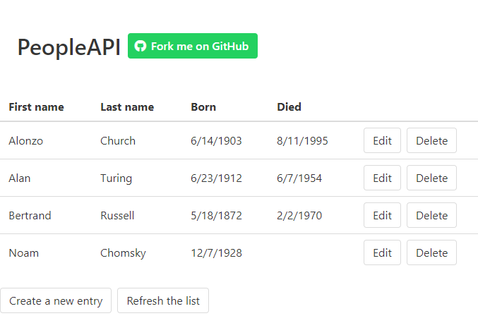

# WebSharper CRUD API Sample [](https://ci.appveyor.com/project/IntelliFactory/peopleclient)

This project demonstrates how to write a pure client-side [WebSharper](https://websharper.com) application that consumes an HTTP API also written with WebSharper. [This project](https://github.com/websharper-samples/PeopleAPI) implements the server for this HTTP API.

It features:

* a [Model-View-Update](https://dotnet-websharper.github.io/mvu) client-side application with multiple pages;
* HTML templating with [WebSharper.UI](https://developers.websharper.com/docs/v4.x/fs/ui#templating);
* server interaction using a WebSharper [Sitelet router](https://developers.websharper.com/docs/v4.x/fs/sitelets#sitelet-infer), defined from the exact same endpoint and data types as the server.

You can see this application running live [here](https://websharper-samples.github.io/PeopleClient). This instance connects to the server running [here](https://peopleapi.websharper.com).

[](https://websharper-samples.github.io/PeopleClient)

## Requirements

* [The .NET Core SDK](https://www.microsoft.com/net/download) version 2.1.401 or newer.
* On Windows: .NET Framework 4.6.1 (select it in Visual Studio installer, or download the Dev Pack [here](https://www.microsoft.com/net/download/dotnet-framework/net461)).
* On OSX or Linux: [Mono 5.10 or newer](https://www.mono-project.com/download/stable/).

## Developing

The recommended way to develop on this project on all platforms is using [Visual Studio Code](https://code.visualstudio.com/) with the Ionide-fsharp extension for F# language support.

To get running, start the "Run Build Task" command (`Ctrl+Shift+B` by default) and select the "watch" task. This starts a job that compiles the application, starts it at urls `http://localhost:5100`, and restarts this process when you save an F# file.

For the same effect from the command line, run the following:

```
cd src
dotnet watch run --server.urls=http://localhost:5100
```

### Developing with a local server side

You can run the server side locally by cloning [its repository](https://github.com/websharper-samples/PeopleAPI) and following its instructions.

To connect to it from this application instead of the default server, change the value `Update.BaseUrl` in `Update.fs` to `http://localhost:5000`.

## Code walkthrough

The application's source code is structured as follows.

* `PeopleAPI`, the server side, is refenced from NuGet. This allows us to use the same types to define the HTTP endpoints and JSON data. 

* `Model.fs` contains the core data model types and functionality.

* `Update.fs` contains the application logic, updating the model based on messages received from the view.

    * Interaction with the server is handled using a Sitelet router. The function `Router.FetchWith` takes a value of the `EndPoint` type and creates a request to the server with the corresponding URL, method and body.

* `View.fs` uses HTML templates parsed from `index.html` to define the view of the application.

* `App.fs` ties all of the above together using MVU's `App.Create`.

* `Startup.fs` contains the only server side code in this application; it defines a simple ASP.NET Core application that serves the contents of `wwwroot`.

## Going further

* [WebSharper home page](https://websharper.com)
* [WebSharper documentation](https://developers.websharper.com)
* [More WebSharper samples](https://github.com/websharper-samples)
* [WebSharper.Mvu](https://dotnet-websharper.github.io/mvu)
